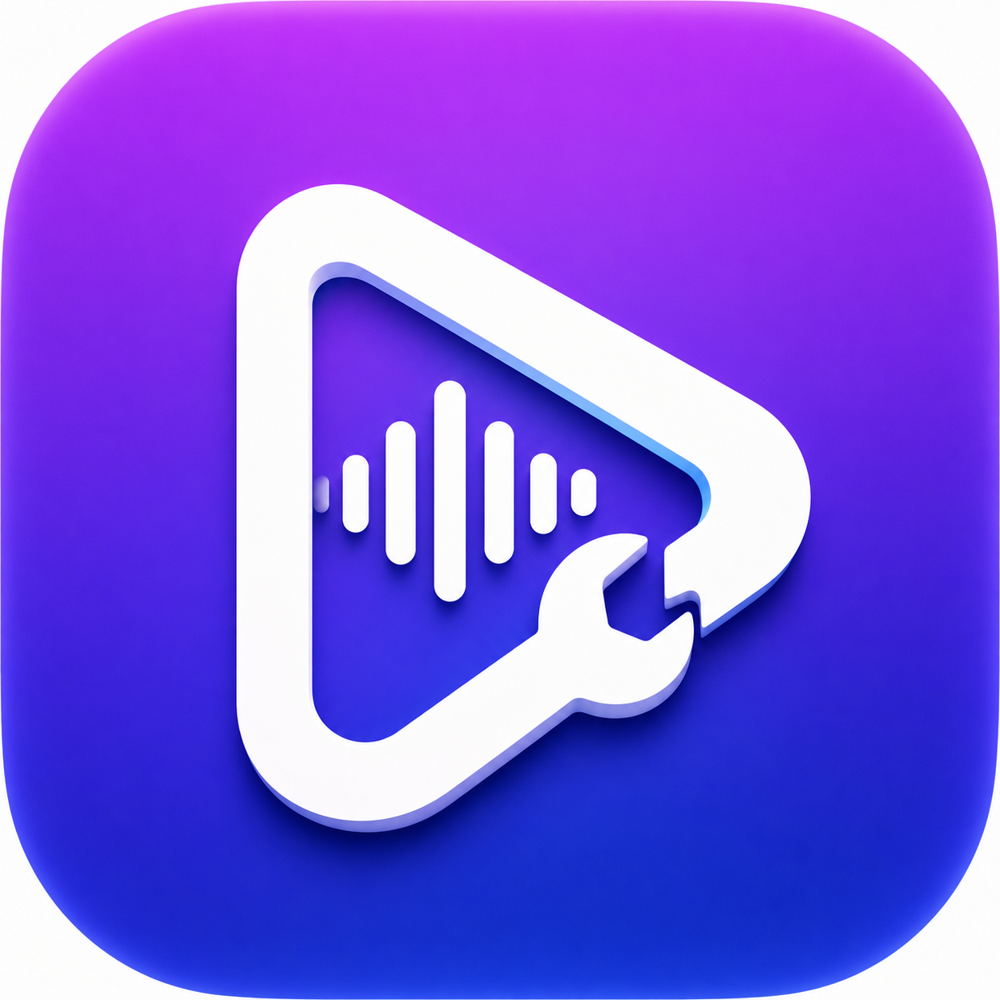

<p align="center">
  
</p>

<h1 align="center">MAD Toolbox</h1>

<p align="center">把常用媒体命令行工具变成简洁、清晰的桌面 GUI。</p>

<p align="center">
  <a href="README.md">English</a> ·
  <a href="https://github.com/MAD-Producer/MAD-Toolbox/actions/workflows/check.yml"></a> ·
  <a href="LICENSE"></a>
</p>

MAD Toolbox 是一个面向 Windows 和 macOS 的开源媒体工具箱。它把表单和
GUI 选项转换为 BBDown、yt-dlp、FFmpeg、MediaInfo 等工具的参数数组，不
经过 Shell 执行，并在独立的日志终端中显示经过脱敏的命令和运行输出。

当前支持 Windows 10 22H2 / Windows 11 x64，以及 macOS 12 以上的 Apple
Silicon 设备。暂不提供 Windows 32 位和 ARM64 安装包。

## 主要功能

- 哔哩哔哩下载：必须先在软件内使用二维码登录；提供最高规格、音频、封面、
  字幕等简易模式，同时尽量覆盖 BBDown 高级参数。
- 网络视频下载：使用 yt-dlp，自动测试 YouTube 连通性，提示开启全局代理或
  填写 HTTP、HTTPS、SOCKS 代理，并提供格式、字幕、Cookie 等高级设置。
- 媒体处理：支持文件和目录拖拽、中文 MediaInfo 信息、转换、重新封装、
  视频/音频/字幕抽流、ASS/SRT、GIF、序列帧以及码率、帧率、尺寸、裁切、
  旋转、速度、像素格式和音频参数。
- PR 智能兼容：优先输出 MP4，能直接复制媒体流时使用 `-c copy`，无法兼容
  时才转码；忽略作为封面的附加图片轨道。
- 音乐下载：检测用户自行安装的 Python 3 和 musicdl 后启用，不在安装包内
  捆绑 musicdl。
- 任务中心：任务切换页面后继续运行，支持取消、彩色日志，以及为每个任务
  导出经过脱敏的诊断 ZIP。
- 设置模板：每个功能支持多个模板并自动恢复上次设置；Cookie 等敏感字段
  使用系统凭据管理器和加密存储。

下载规格、会员内容、HDR、杜比视界和高码率资源取决于当前登录账号的会员、
内容及地区权限。“最高规格”指该账号实际能够访问的最高规格。请仅下载自己
拥有或获得授权的内容，本项目不会绕过 DRM。

## Full 与 Lite

Full 版内置经过固定版本和 SHA-256 校验的 BBDown、FFmpeg/ffprobe、
MediaInfo CLI、yt-dlp 和 Deno，不需要用户另外安装这些命令行工具。

Lite 版只内置 BBDown。Windows 可通过 WinGet 安装其余依赖：

```powershell
winget install --id Gyan.FFmpeg -e
winget install --id yt-dlp.yt-dlp -e
winget install --id MediaArea.MediaInfo.CLI -e
winget install --id DenoLand.Deno -e
```

macOS 可使用 Homebrew：

```bash
brew install ffmpeg yt-dlp media-info deno
```

Full 和 Lite 共用同一套功能页面。用户可以在设置中让每个工具优先使用内置
版本、系统最新版或自定义路径。

musicdl 因许可证要求不随软件分发。安装方法、USTC/TUNA pip 镜像配置以及
依赖检测均已放在音乐下载页面。

## 从源码构建

需要 Node.js 22、Rust stable 和对应平台的原生构建工具。

Windows x64：

```powershell
npm install
npm run tauri:build:windows:lite
npm run tauri:build:windows:full
```

Apple Silicon macOS：

```bash
npm install
npm run tauri:build:lite
npm run verify:bundled
npm run tauri:build:full
```

Windows 构建脚本会下载 Git 仓库未保存的大型 sidecar，先校验压缩包及程序
SHA-256，再生成中英双语 NSIS 安装包。Windows 安装包可以不购买证书直接
使用，但未签名版本可能触发 SmartScreen 的“未知发布者”提示。

## 文档

- [Windows 兼容性、构建与安全说明](docs/WINDOWS.md)
- [Lite 版依赖安装](docs/DEPENDENCIES.md)
- [Full 版打包和再分发规则](docs/FULL_BUILD.md)
- [第三方软件署名和许可证](THIRD_PARTY_NOTICES.md)
- [参与贡献](CONTRIBUTING.md)
- [安全问题报告](SECURITY.md)

## 许可证

MAD Toolbox 源代码使用 MIT License。所有内置工具保留各自的许可证、
版权和署名，详见 [THIRD_PARTY_NOTICES.md](THIRD_PARTY_NOTICES.md)。
